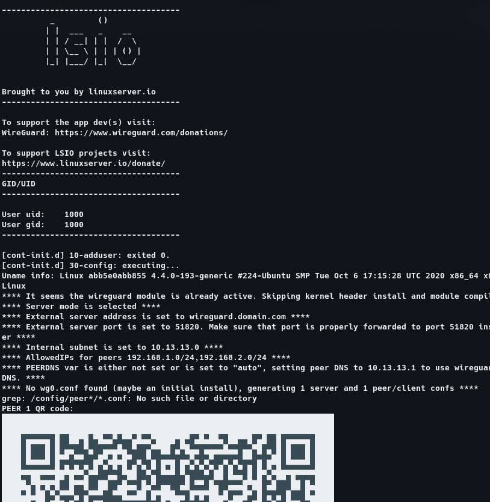

# How to connect to kubernetes internal network using WireGuard


When you are testing your deployments in a kubernetes cluster on the cloud you have a few options to expose your services outside world, for example you can use a `NodePort` service, but also you need to configure the firewall rules for each `NodePort` service, the other type of service that you can use is `LoadBalancer` however each of them is billed by cloud provider. To solve this problem you can use a vpn running within your k8s cluster, this vpn can be exposed outside the cluster with a `NodePort` or `LoadBalancer` service. As client you can access to you kubernetes internal network using service `FQDN` in your local machine.

In this tutorial we gonna setup a pod that run wireguard server, this wireguard will be configured with the kube-dns service and generate cliente credentials automatically the diagram will be like this:


Assuming that you are in a testing k8s cluster in the cloud with multiple namespaces and services. 

First we need to know the `kube-dns` IP address with the following command
```sh
$ kubectl -n kube-system get svc | grep kube-dns | awk '{print $3}'
# output example: 10.124.0.10
```

In order to isolate wireguard server from another apps, we need to create a wireguard namespace named `wireguard`
```yaml 
apiVersion: v1
kind: Namespace
metadata:
  name: wireguard
  labels:
    name: wireguard
```

To store wireguard config files, we need a persistent volume, in my case i’m using a gke managed service that provides me a storage class, so i’m gonna create a persistent volume claim to that storage class.

```yaml
apiVersion: v1
kind: PersistentVolumeClaim
metadata:
  name: pv-claim-wireguard 
  namespace: wireguard
spec:
  storageClassName: "standard"
  accessModes:
    - ReadWriteOnce
  resources:
    requests:
      storage: 10M
```

The next thing to configure is the environment variables of wireguard server, this will be do with a config map. The `kube-dns` IP from steps earlier will be set in `PEERDNS` field.

```yaml
apiVersion: v1
kind: ConfigMap
metadata:
  name: wireguard-configmap
  namespace: wireguard
data:
  PUID: "1000"
  PGID: "1000"
  TZ: "America/Mexico_City"
  SERVERPORT: "31820"
  PEERS: "2"
  PEERDNS: "10.124.0.10"
  ALLOWEDIPS: "0.0.0.0/0, ::/0"
  INTERNAL_SUBNET: "10.13.13.0"
```

Now we can create the wireguard server pod, this pod needs to be privileged with `NET_ADMIN` and `SYS_MODULE` capabilities and needs to mount `/lib/modules` directory from the host. The image used is `ghcr.io/linuxserver/wireguard` from [linuxserver.io](https://hub.docker.com/r/linuxserver/wireguard)

```yaml
apiVersion: v1
kind: Pod
metadata:
  name: wireguard
  namespace: wireguard
  labels:
    app: wireguard
spec:
  containers:
  - name: wireguard
    image: ghcr.io/linuxserver/wireguard
    envFrom:
    - configMapRef:
        name: wireguard-configmap 
    securityContext:
      capabilities:
        add:
          - NET_ADMIN
          - SYS_MODULE
      privileged: true
    volumeMounts:
      - name: wg-config
        mountPath: /config
      - name: host-volumes
        mountPath: /lib/modules
    ports:
    - containerPort: 51820
      protocol: UDP
    resources:
      requests:
        memory: "64Mi"
        cpu: "100m"
      limits:
        memory: "128Mi"
        cpu: "200m"
  volumes:
    - name: wg-config
      persistentVolumeClaim:
        claimName: pv-claim-wireguard 
    - name: host-volumes
      hostPath:
        path: /lib/modules
        type: Directory
```

Finally to access to wireguard server, we need to create a service, this service could be a `NodePort` or `LoadBalancer`, in my case i used a `NodePort` service on port `31820`, take in mind that you probably need to configure a firewall rule to access at this service. 

```yaml
kind: Service
apiVersion: v1
metadata:
  labels:
    k8s-app: wireguard
  name: wireguard-service
  namespace: wireguard
spec:
  type: NodePort
  ports:
  - port: 51820
    nodePort: 31820
    protocol: UDP
    targetPort: 51820
  selector:
    app: wireguard
```

This configurations are in a single file `wireguard-pod.yaml` to execute just apply the file with `kubectl` command
```sh
$ kubectl apply -f wireguard-pod.yaml
```

The container generate a `QR` code for each peer, these `QR` appears in the logs of the pod, to see just type the following command

```sh
$ kubectl -n wireguard logs wireguard
```

The output will be like this


In order to connect to wireguard server download mobile app of install in your local machine. See [wireguard.com](https://www.wireguard.com/install/)

You can scan the code with the mobile app or copy the config file in your computer at `~/peer1.conf`
```sh
$ kubectl -n wireguard exec wireguard -- cat /config/peer1/peer1.conf > ~/peer1.conf
```

Now you can utilize the config file to activate the vpn. With `NetworManager` you can import the config file

```sh
$ nmcli connection import type wireguard file ~/peer1.conf
```

And activate or deactivate the connection
```sh
$ nmcli connection up peer1 
$ nmcli connection down peer1 
```

Finally to access a `ClusterIP` service within k8s cluster just use the IP of `ClusterIP` service or use the `FQDN` of the service using the following rule
```
<clusterip-service>.<namespace>.svc.cluster.local
```
Check the output of `dig` in a `FQDN` inside a remote k8s cluster, note that the query is answered by `kube-dns` IP inside the k8s cluster.


For example to access a `ClusterIP` service named `thingsboard-service` in the namespace `thingsboard` at `9090` port from our local machine through wireguard vpn:
```
http://thingsboard-service.thingsboard.svc.cluster.local:9090
```

And the output in our local environment


# Conclusion

This method is very useful for a managed kubernetes service in the cloud in a development environment because we can test our services without configure a nodePort for each service and his respectively firewall rule.

**WARNING: Only use this method in a development environment, don’t use in a production environment**

[Source Code](https://github.com/ivanmorenoj/k8s-wireguard)
